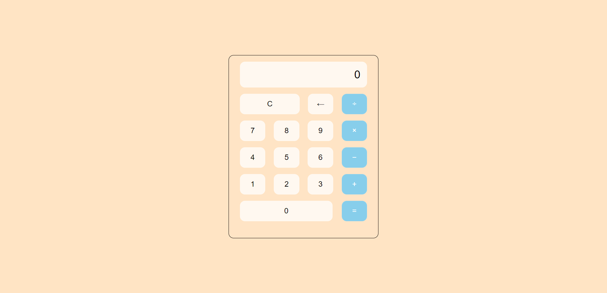

# Day 1: Calculator

This calculator application is built in JS, HTML, and CSS to perform basic operations.

## Features include
- Addition
- Subtraction
- Multiplication
- Division
- Clear input functionality

## Usage

To use this application please launch it in live preview.

## Image of calculator

