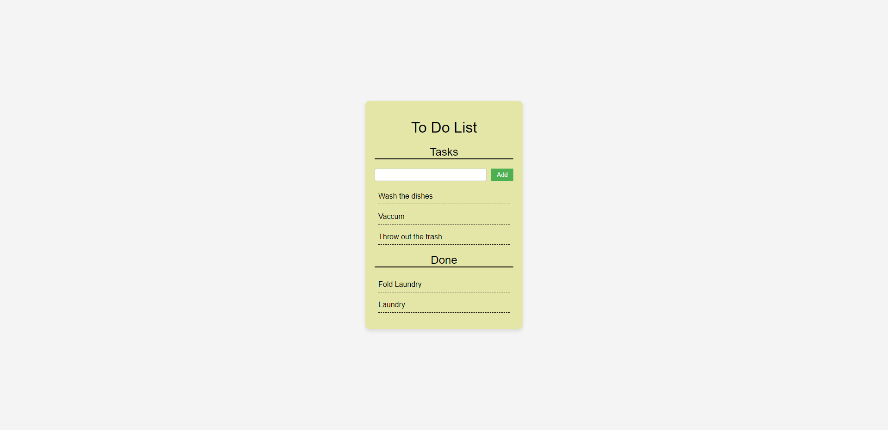
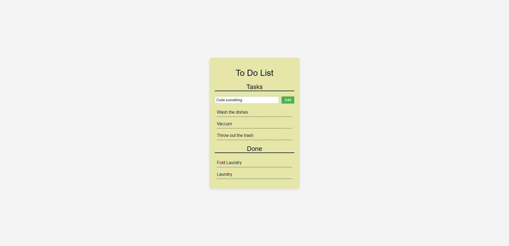
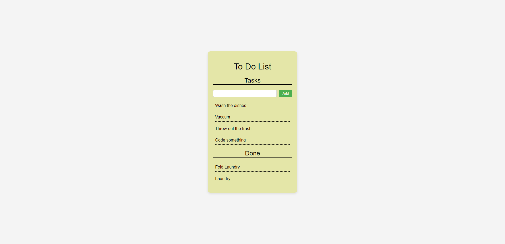
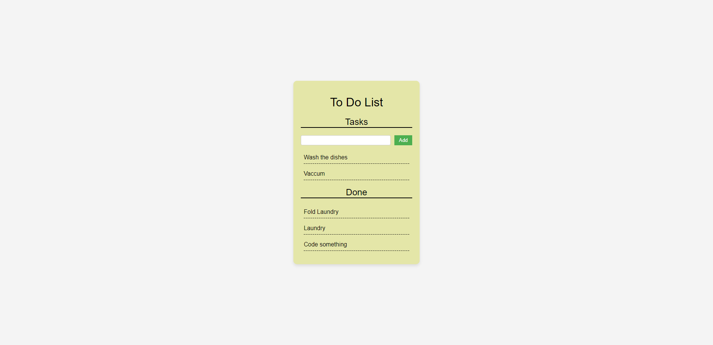

# Day 2: ToDo list

This to-do list application is built in JS, HTML, and CSS to allow users to keep track of their tasks.

## Features include

- Adding tasks to the list
- Removing tasks from the list
- Moving completed tasks to the done list

## Usage

To use this application simply type in a task and click add.
Once the task is done clicking the task will move it to the done list.
If you'd like to clear the done list, click the task once more.

## Images of The ToDo list

### Main Screen

### Task Being Added

### Task Added to List

### Task Being Moved to Done

