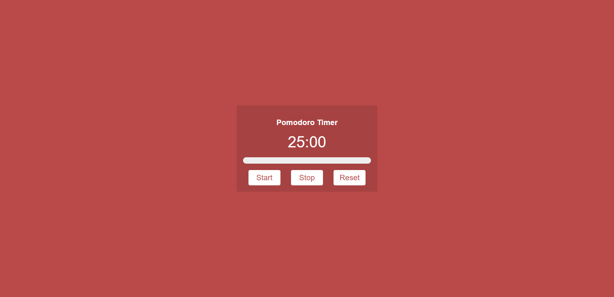
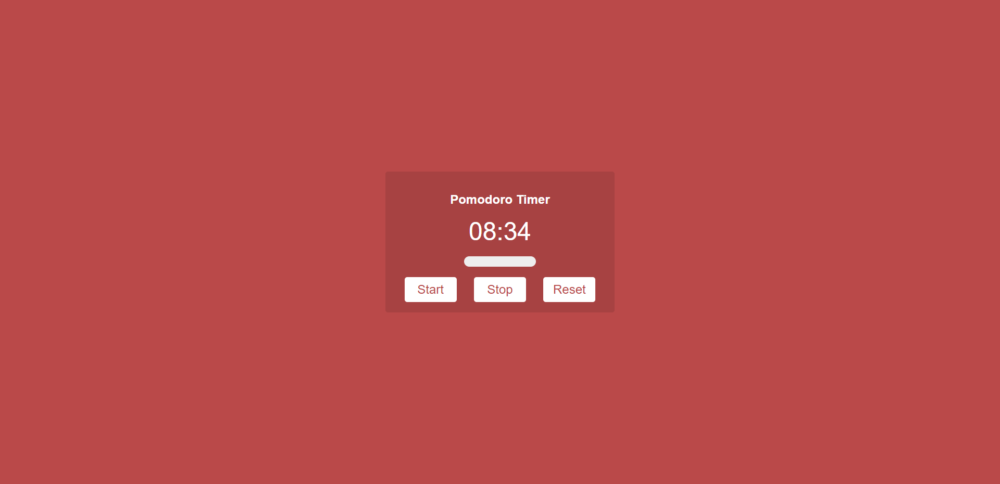
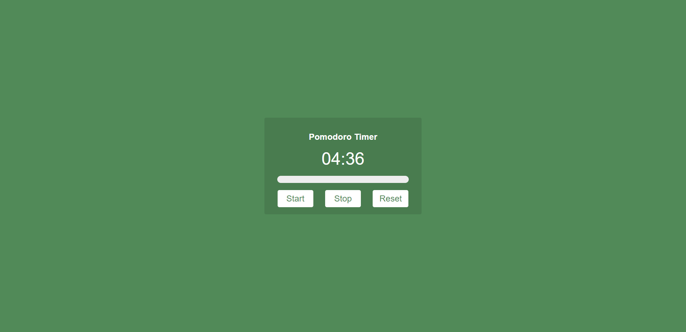

# Day 3: Pomodoro Timer

This application is made for using the Pomodoro method, Which requires you to work for 25 minutes then take a 5 minute break.
Made in JS, HTML, CSS

## Features include
- Starting the timer
- Stopping the timer
- Resetting the timer

## Usage
To use this application simply hit the start button, if you'd like to take a pause hit the stop button.
To Reset hit the reset button.

## Images of Pomodoro

### Main Screen

### In Progress

### Break Mode

